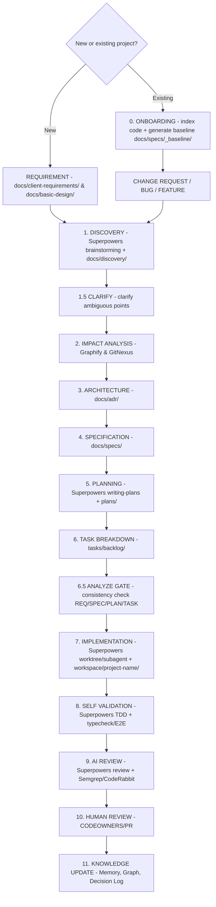

# STANDARDIZED PROGRAMMING WORKFLOW FOR AI AGENTS (00-ai-workflow.md)

This document is the **SINGLE SOURCE OF TRUTH** for the workflow. All AI Agents (Claude Code, Cursor, Codex, Antigravity, Windsurf, Copilot) **MUST comply 100%**.

Vide-Coder is a **workflow overlay base** — it layers on top of any repo (new or existing) **without touching the target project's source**.

---

## 🛑 GOLDEN RULES

1. **THE BASE IS AN OVERLAY**: It only covers the workflow layer + documentation (`.agent/`, `docs/`, entry-points). **The target project's source lives in `workspace/<project-name>/`** (fully gitignored) — the AI Agent reads/edits code HERE, not at the root.
2. **USE EXTERNAL PLUGINS, DON'T REBUILD**: Skills/methodology use **Superpowers** as the engine; the code graph uses **Graphify/GitNexus**; documentation lookup uses **Context7**; security uses **Semgrep**. If not installed → run `.agent/scripts/install-all-plugins.sh`.
3. **FLEXIBLE ENTRY POINT**: New projects enter from the **BRD/Excel**; existing projects enter from a **change request/bug/feature** (after running **Step 0 Onboarding**).
4. **FOLLOW ALL STEPS**: Never skip Discovery, Impact Analysis, or Self-Validation.
5. **ISOLATE WITH GIT WORKTREE**: Each task runs in its own worktree (Superpowers skill `using-git-worktrees`).
6. **UPDATE KNOWLEDGE AT THE END**: Re-index Graphify + update `.agent/memory/decision-log.md` + `docs/traceability-matrix.md`.

---

## 🧭 ROLES: SUPERPOWERS (engine) vs VIDE-CODER (enterprise)

Install Superpowers as the engine → it handles the "one skilled developer" part. Vide-Coder **wraps the enterprise layer** on top and **orchestrates**.

| Step | Who handles it | Mechanism / tools |
| :-- | :-- | :-- |
| 0. Onboarding (existing projects only) | **Vide-Coder** | `onboard-existing.sh` + Graphify/GitNexus → `docs/specs/_baseline/`; initialize `docs/CONSTITUTION.md` |
| 1. Discovery | **Superpowers** `brainstorming` | + trace into `docs/discovery/` |
| 1.5 Clarify | **Vide-Coder** | clarify ambiguous points → `docs/discovery/*-clarifications.md` |
| 2. Impact Analysis | **Vide-Coder** | Graphify / GitNexus (blast radius) |
| 3. Architecture | **Vide-Coder** | ADR/RFC `docs/adr/` |
| 4. Specification | **Vide-Coder** | `docs/specs/` (+ Context7) |
| 5. Planning | **Superpowers** `writing-plans` | + milestone/sprint |
| 6. Task Breakdown | **Vide-Coder** | `tasks/` + traceability |
| 6.5 Analyze (GATE) | **Vide-Coder** | consistency check REQ↔SPEC↔ADR↔PLAN↔TASK before coding |
| 7. Implementation | **Superpowers** `using-git-worktrees` + `subagent-driven-development` + `executing-plans` | source in `workspace/<project-name>/` |
| 8. Self Validation | **Superpowers** `test-driven-development` + `verification-before-completion` | + typecheck/E2E |
| 9. AI Review | **Superpowers** `requesting/receiving-code-review` | + Semgrep + CodeRabbit |
| 10. Human Review | **Vide-Coder** | CODEOWNERS + PR template |
| 11. Knowledge Update | **Vide-Coder** | ADR + memory + re-index graph + changelog |

> Vide-Coder **does not rewrite** steps 1, 5, 7, 8, 9 — it uses the Superpowers skills directly. It only **adds** steps 0, 2, 3, 4, 6, 10, 11.

---

## 🔄 STANDARD EXECUTION WORKFLOW

### 0. ONBOARDING (existing projects only — brownfield)
- Run `.agent/scripts/onboard-existing.sh`: index the existing codebase with Graphify/GitNexus.
- Generate a current-state **baseline** (architecture, main modules) into `docs/specs/_baseline/` as a reference point for Impact Analysis.
- Initialize the **project constitution** `docs/CONSTITUTION.md` (stack, invariant constraints) — used by the `/analyze` gate.
- Skip the baseline for new projects, but still fill in `docs/CONSTITUTION.md`.

### 1. DISCOVERY (Brainstorm / Q&A / Research)
- **Flexible entry point**:
  - *New project*: read `docs/client-requirements/` + `docs/basic-design/`.
  - *Existing project*: the entry point is a change request/bug/feature; cross-check against `docs/specs/_baseline/`.
- Use the Superpowers `brainstorming` skill to challenge and clarify requirements; record traces into `docs/discovery/` following `docs/discovery/discovery-template.md`.

### 1.5 CLARIFY (Clarify ambiguous points)
- Extract blocking questions (edge cases, non-functional requirements, scope boundaries) and **ask the user** before writing the Spec.
- Record the results into `docs/discovery/<feature>-clarifications.md`; new invariant constraints → `docs/CONSTITUTION.md`.
- Skill: [`clarify-requirements.md`](.claude/skills/clarify-requirements/SKILL.md). Command: `/clarify`.

### 2. IMPACT ANALYSIS (Graphify / GitNexus / Dependency Graph)
- Analyze the blast radius & affected modules via Graphify/GitNexus.
- Skill: [`.claude/skills/impact-analysis/SKILL.md`](.claude/skills/impact-analysis/SKILL.md).

### 3. ARCHITECTURE (ADR / RFC / Decisions)
- For major changes: write an RFC (`docs/adr/rfc-template.md`), then finalize an ADR (`docs/adr/adr-template.md`). Register it in `.agent/memory/decision-log.md`.
- Subagent: [`architect.md`](../agents/architect.md).

### 4. SPECIFICATION (Functional + Technical Spec)
- Generate `docs/specs/SPEC-XXX.md`; look up framework documentation with Context7 as needed.
- Skill: [`parse-client-requirements.md`](.claude/skills/write-spec/SKILL.md) / [`parse-basic-design-excel.md`](.claude/skills/write-spec/SKILL.md).

### 5. PLANNING (Milestone / Sprint / Timeline)
- Use the Superpowers `writing-plans` skill; save to `plans/yyyy-mm-dd-<feature>.md`. Subagent: [`planner.md`](../agents/planner.md).

### 6. TASK BREAKDOWN (Epic → Story → Task → Subtask)
- Create `tasks/backlog/PROJECT-XXX.md`; update `docs/traceability-matrix.md`.
- Skill: [`jira-task-breakdown.md`](.claude/skills/task-breakdown/SKILL.md).

### 6.5 ANALYZE (GATE — cross-consistency check before coding)
- Check coverage + traceability + contradictions REQ↔SPEC↔ADR↔PLAN↔TASK and violations of `docs/CONSTITUTION.md`.
- **Any 🔴 BLOCKER remaining → STOP**, go back to Spec/Plan/Breakdown to patch it; do not proceed to Step 7.
- Skill: [`analyze-consistency.md`](.claude/skills/analyze-consistency/SKILL.md). Command: `/analyze`.

### 7. IMPLEMENTATION (Git Worktree + Coding Agent)
- Use the Superpowers `using-git-worktrees` + `subagent-driven-development` skills; code in **`workspace/<project-name>/`**.
- Vide-Coder skills: [`git-worktree-flow.md`](.claude/skills/git-worktree-flow/SKILL.md), [`code-traceability-linkage.md`](.claude/skills/code-traceability/SKILL.md).

### 8. SELF VALIDATION (Lint + Typecheck + Unit + E2E)
- Use the Superpowers `test-driven-development` + `verification-before-completion` skills; run Semgrep-lint, typecheck, Playwright E2E.
- Skill: [`tdd-workflow.md`](.claude/skills/tdd-workflow/SKILL.md). Subagent: [`e2e-runner.md`](../agents/e2e-runner.md).

### 9. AI REVIEW (Code + Security + Performance)
- Use the Superpowers `requesting-code-review` / `receiving-code-review` skills; Semgrep (OWASP) + CodeRabbit.
- Subagent: [`security-reviewer.md`](../agents/security-reviewer.md). Skill: [`code-review.md`](.claude/skills/code-review/SKILL.md).

### 10. HUMAN REVIEW (PR Approval & Merge Checklist)
- Open a PR via GitHub MCP (using `.github/pull_request_template.md`), and wait for CODEOWNER approval.

### 11. KNOWLEDGE UPDATE (ADR + Memory + Graph + Changelog)
- Re-index Graphify/GitNexus; update `.agent/memory/decision-log.md`, `docs/traceability-matrix.md`, and the changelog `docs/spec-changes/`.
- Skill: [`post-implementation-review.md`](.claude/skills/knowledge-update/SKILL.md).
