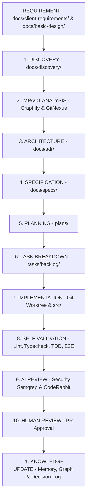

# QUY TRÌNH 11 BƯỚC LẬP TRÌNH CHUẨN HÓA CHO AI AGENT (00-ai-workflow.md)

Tài liệu này định nghĩa **Quy trình 11 bước lập trình phần mềm chuẩn hóa** mà tất cả các AI Agent (Claude Code, Cursor, Codex, Antigravity, Windsurf) PHẢI tuân thủ 100%.

---

## 🛑 NGUYÊN TẮC VÀNG
1. **TỰ ĐỘNG CÀI PLUGIN MẪU NẾU DỰ ÁN MỚI**: Nếu dự án chưa được cài đặt Plugin, chạy ngay script installer tại `.agent/plugins/installer/install-all-plugins.sh`.
2. **TUÂN THỦ HOÀN TOÀN QUY TRÌNH 11 BƯỚC**: Không bao giờ bỏ qua các bước Discovery, Impact Analysis hay Self-Validation.
3. **CÔ LẬP NGHỆ SĨ CODE BẰNG GIT WORKTREE**: Sử dụng Git Worktree khi lập trình song song nhiều task.
4. **CẬP NHẬT TRI THỨC SAU KHI HOÀN THÀNH**: Luôn chạy re-index Graphify/Superpower và cập nhật `memory/decision-log.md` ở bước cuối cùng.

---

## 🔄 11 BƯỚC THỰC THI CHUẨN (11-STEP OPERATING PROCEDURE)

### 1. DISCOVERY (Brainstorm / Q&A / Research)
- Đọc tài liệu yêu cầu ban đầu (`docs/client-requirements/`, `docs/basic-design/`).
- Đặt câu hỏi phản biện, làm rõ yêu cầu mờ đục và lưu vết vào `docs/discovery/`.
- Thực thi Skill: [`.agent/skills/core/discovery-brainstorm.md`](file:///home/duytan/Tan/Coder/Vide-code/.agent/skills/core/discovery-brainstorm.md).

### 2. IMPACT ANALYSIS (Graphify / GitNexus / Dependency Graph)
- Phân tích Blast Radius và các module bị ảnh hưởng khi thay đổi code.
- Thực thi Skill: [`.agent/skills/core/impact-analysis.md`](file:///home/duytan/Tan/Coder/Vide-code/.agent/skills/core/impact-analysis.md).

### 3. ARCHITECTURE (ADR / RFC / Decisions)
- Đánh giá kiến trúc, viết hồ sơ quyết định kiến trúc nếu có thay đổi lớn.
- Lưu vào `docs/adr/`. Thực thi Subagent: [`architect.md`](file:///home/duytan/Tan/Coder/Vide-code/.agent/agents/architect.md).

### 4. SPECIFICATION (Functional Spec + Technical Spec)
- Sinh đặc tả chi tiết trong `docs/specs/SPEC-XXX.md`.
- Thực thi Skill: [`.agent/skills/core/parse-client-requirements.md`](file:///home/duytan/Tan/Coder/Vide-code/.agent/skills/core/parse-client-requirements.md) hoặc [`.agent/skills/core/parse-basic-design-excel.md`](file:///home/duytan/Tan/Coder/Vide-code/.agent/skills/core/parse-basic-design-excel.md).

### 5. PLANNING (Milestone / Sprint / Timeline)
- Lập Implementation Plan chi tiết trong `plans/yyyy-mm-dd-<feature>.md`.
- Thực thi Subagent: [`planner.md`](file:///home/duytan/Tan/Coder/Vide-code/.agent/agents/planner.md).

### 6. TASK BREAKDOWN (Epic → Story → Task → Subtask)
- Chia nhỏ công việc thành các task Jira chuẩn Backlog trong `tasks/backlog/PROJECT-XXX.md`.
- Thực thi Skill: [`.agent/skills/core/jira-task-breakdown.md`](file:///home/duytan/Tan/Coder/Vide-code/.agent/skills/core/jira-task-breakdown.md).

### 7. IMPLEMENTATION (Git Worktree + Coding Agent)
- Tạo Git Worktree cô lập không gian làm việc.
- Tiến hành viết code sản phẩm tại `src/`.
- Thực thi Skill: [`.agent/skills/core/git-worktree-flow.md`](file:///home/duytan/Tan/Coder/Vide-code/.agent/skills/core/git-worktree-flow.md) & [`.agent/skills/core/code-traceability-linkage.md`](file:///home/duytan/Tan/Coder/Vide-code/.agent/skills/core/code-traceability-linkage.md).

### 8. SELF VALIDATION (Lint + Typecheck + Unit Test + E2E)
- Chạy static linter, typecheck, Unit Test (TDD Workflow) và Playwright E2E test.
- Thực thi Skill: [`.agent/skills/core/tdd-workflow.md`](file:///home/duytan/Tan/Coder/Vide-code/.agent/skills/core/tdd-workflow.md) & Subagent [`e2e-runner.md`](file:///home/duytan/Tan/Coder/Vide-code/.agent/agents/e2e-runner.md).

### 9. AI REVIEW (Code Review + Security + Performance)
- Quét lỗ hổng bảo mật với Semgrep và tự động review code với CodeRabbit/AI Reviewer.
- Thực thi Subagent: [`security-reviewer.md`](file:///home/duytan/Tan/Coder/Vide-code/.agent/agents/security-reviewer.md) & Skill [`.agent/skills/core/code-review.md`](file:///home/duytan/Tan/Coder/Vide-code/.agent/skills/core/code-review.md).

### 10. HUMAN REVIEW (PR Approval & Merge Checklist)
- Đưa Pull Request lên GitHub bằng GitHub MCP, chờ Human Lead/Senior duyệt.

### 11. KNOWLEDGE UPDATE (ADR + Memory + Graph + Changelog)
- Re-index Graphify & Superpower Knowledge Graph.
- Cập nhật nhật ký quyết định vào `.agent/memory/decision-log.md`.
- Thực thi Skill: [`.agent/skills/core/post-implementation-review.md`](file:///home/duytan/Tan/Coder/Vide-code/.agent/skills/core/post-implementation-review.md).
