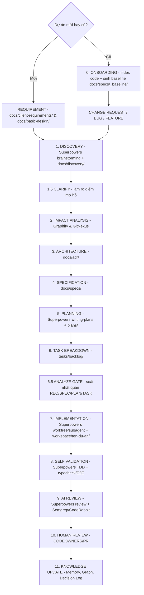

# QUY TRÌNH LẬP TRÌNH CHUẨN HÓA CHO AI AGENT (00-ai-workflow.md)

Tài liệu này là **NGUỒN CHÂN LÝ DUY NHẤT** về quy trình. Tất cả AI Agent (Claude Code, Cursor, Codex, Antigravity, Windsurf, Copilot) **PHẢI tuân thủ 100%**.

Vide-Coder là **base overlay quy trình** — áp lên bất kỳ repo nào (mới/cũ) mà **không đụng source của dự án đích**.

---

## 🛑 NGUYÊN TẮC VÀNG

1. **BASE LÀ OVERLAY**: Chỉ phủ tầng quy trình + tài liệu (`.agent/`, `docs/`, entry-points). **Source dự án đích nằm trong `workspace/<ten-du-an>/`** (gitignore toàn bộ) — AI Agent đọc/sửa code TẠI ĐÂY, không phải ở root.
2. **DÙNG PLUGIN NGOÀI, KHÔNG REBUILD**: Skill/methodology dùng **Superpowers** làm engine; đồ thị code dùng **Graphify/GitNexus**; tra tài liệu dùng **Context7**; security dùng **Semgrep**. Nếu chưa cài → chạy `.agent/scripts/install-all-plugins.sh`.
3. **ĐIỂM VÀO LINH HOẠT**: Dự án mới vào từ **BRD/Excel**; dự án cũ vào từ **change request/bug/feature** (sau khi đã chạy **Bước 0 Onboarding**).
4. **TUÂN THỦ ĐỦ CÁC BƯỚC**: Không bao giờ bỏ qua Discovery, Impact Analysis, Self-Validation.
5. **CÔ LẬP BẰNG GIT WORKTREE**: Mỗi task chạy trong worktree riêng (skill Superpowers `using-git-worktrees`).
6. **CẬP NHẬT TRI THỨC CUỐI CÙNG**: Re-index Graphify + cập nhật `.agent/memory/decision-log.md` + `docs/traceability-matrix.md`.

---

## 🧭 PHÂN VAI: SUPERPOWERS (engine) vs VIDE-CODER (enterprise)

Cài Superpowers làm engine → nó lo phần "một dev giỏi". Vide-Coder **bọc tầng doanh nghiệp** lên trên và **điều phối**.

| Bước | Ai lo | Cơ chế / công cụ |
| :-- | :-- | :-- |
| 0. Onboarding (chỉ dự án cũ) | **Vide-Coder** | `onboard-existing.sh` + Graphify/GitNexus → `docs/specs/_baseline/`; khởi tạo `docs/CONSTITUTION.md` |
| 1. Discovery | **Superpowers** `brainstorming` | + ghi vết `docs/discovery/` |
| 1.5 Clarify | **Vide-Coder** | làm rõ điểm mơ hồ → `docs/discovery/*-clarifications.md` |
| 2. Impact Analysis | **Vide-Coder** | Graphify / GitNexus (blast radius) |
| 3. Architecture | **Vide-Coder** | ADR/RFC `docs/adr/` |
| 4. Specification | **Vide-Coder** | `docs/specs/` (+ Context7) |
| 5. Planning | **Superpowers** `writing-plans` | + milestone/sprint |
| 6. Task Breakdown | **Vide-Coder** | `tasks/` + traceability |
| 6.5 Analyze (GATE) | **Vide-Coder** | soát nhất quán REQ↔SPEC↔ADR↔PLAN↔TASK trước khi code |
| 7. Implementation | **Superpowers** `using-git-worktrees` + `subagent-driven-development` + `executing-plans` | source tại `workspace/<ten-du-an>/` |
| 8. Self Validation | **Superpowers** `test-driven-development` + `verification-before-completion` | + typecheck/E2E |
| 9. AI Review | **Superpowers** `requesting/receiving-code-review` | + Semgrep + CodeRabbit |
| 10. Human Review | **Vide-Coder** | CODEOWNERS + PR template |
| 11. Knowledge Update | **Vide-Coder** | ADR + memory + re-index graph + changelog |

> Vide-Coder **không viết lại** bước 1,5,7,8,9 — dùng thẳng skill Superpowers. Chỉ **thêm** bước 0,2,3,4,6,10,11.

---

## 🔄 QUY TRÌNH THỰC THI CHUẨN

### 0. ONBOARDING (chỉ dự án cũ — brownfield)
- Chạy `.agent/scripts/onboard-existing.sh`: index codebase hiện có bằng Graphify/GitNexus.
- Sinh **baseline** hiện trạng (kiến trúc, module chính) vào `docs/specs/_baseline/` để làm mốc cho Impact Analysis.
- Khởi tạo **hiến pháp dự án** `docs/CONSTITUTION.md` (stack, ràng buộc bất biến) — dùng cho gate `/analyze`.
- Bỏ qua baseline nếu là dự án mới, nhưng vẫn điền `docs/CONSTITUTION.md`.

### 1. DISCOVERY (Brainstorm / Q&A / Research)
- **Điểm vào linh hoạt**:
  - *Dự án mới*: đọc `docs/client-requirements/` + `docs/basic-design/`.
  - *Dự án cũ*: điểm vào là change request/bug/feature; đối chiếu `docs/specs/_baseline/`.
- Dùng skill Superpowers `brainstorming` để phản biện, làm rõ yêu cầu; ghi vết vào `docs/discovery/` theo `docs/discovery/discovery-template.md`.

### 1.5 CLARIFY (Làm rõ điểm mơ hồ)
- Bóc tách câu hỏi chặn (edge case, phi chức năng, ranh giới scope) và **hỏi user** trước khi viết Spec.
- Ghi kết quả vào `docs/discovery/<feature>-clarifications.md`; ràng buộc bất biến mới → `docs/CONSTITUTION.md`.
- Skill: [`clarify-requirements.md`](.claude/skills/clarify-requirements/SKILL.md). Command: `/clarify`.

### 2. IMPACT ANALYSIS (Graphify / GitNexus / Dependency Graph)
- Phân tích blast radius & module bị ảnh hưởng qua Graphify/GitNexus.
- Skill: [`.claude/skills/impact-analysis/SKILL.md`](.claude/skills/impact-analysis/SKILL.md).

### 3. ARCHITECTURE (ADR / RFC / Decisions)
- Nếu thay đổi lớn: viết RFC (`docs/adr/rfc-template.md`) rồi chốt ADR (`docs/adr/adr-template.md`). Đăng ký `.agent/memory/decision-log.md`.
- Subagent: [`architect.md`](../agents/architect.md).

### 4. SPECIFICATION (Functional + Technical Spec)
- Sinh `docs/specs/SPEC-XXX.md`; tra tài liệu framework bằng Context7 khi cần.
- Skill: [`parse-client-requirements.md`](.claude/skills/write-spec/SKILL.md) / [`parse-basic-design-excel.md`](.claude/skills/write-spec/SKILL.md).

### 5. PLANNING (Milestone / Sprint / Timeline)
- Dùng skill Superpowers `writing-plans`; lưu `plans/yyyy-mm-dd-<feature>.md`. Subagent: [`planner.md`](../agents/planner.md).

### 6. TASK BREAKDOWN (Epic → Story → Task → Subtask)
- Tạo `tasks/backlog/PROJECT-XXX.md`; cập nhật `docs/traceability-matrix.md`.
- Skill: [`jira-task-breakdown.md`](.claude/skills/task-breakdown/SKILL.md).

### 6.5 ANALYZE (GATE — soát nhất quán chéo trước khi code)
- Kiểm tra coverage + traceability + mâu thuẫn REQ↔SPEC↔ADR↔PLAN↔TASK và vi phạm `docs/CONSTITUTION.md`.
- **Còn 🔴 BLOCKER → DỪNG**, quay lại Spec/Plan/Breakdown để vá; không sang Bước 7.
- Skill: [`analyze-consistency.md`](.claude/skills/analyze-consistency/SKILL.md). Command: `/analyze`.

### 7. IMPLEMENTATION (Git Worktree + Coding Agent)
- Dùng skill Superpowers `using-git-worktrees` + `subagent-driven-development`; code trong **`workspace/<ten-du-an>/`**.
- Skill Vide-Coder: [`git-worktree-flow.md`](.claude/skills/git-worktree-flow/SKILL.md), [`code-traceability-linkage.md`](.claude/skills/code-traceability/SKILL.md).

### 8. SELF VALIDATION (Lint + Typecheck + Unit + E2E)
- Dùng skill Superpowers `test-driven-development` + `verification-before-completion`; chạy Semgrep-lint, typecheck, Playwright E2E.
- Skill: [`tdd-workflow.md`](.claude/skills/tdd-workflow/SKILL.md). Subagent: [`e2e-runner.md`](../agents/e2e-runner.md).

### 9. AI REVIEW (Code + Security + Performance)
- Dùng skill Superpowers `requesting-code-review` / `receiving-code-review`; Semgrep (OWASP) + CodeRabbit.
- Subagent: [`security-reviewer.md`](../agents/security-reviewer.md). Skill: [`code-review.md`](.claude/skills/code-review/SKILL.md).

### 10. HUMAN REVIEW (PR Approval & Merge Checklist)
- Mở PR bằng GitHub MCP (dùng `.github/pull_request_template.md`), chờ CODEOWNER duyệt.

### 11. KNOWLEDGE UPDATE (ADR + Memory + Graph + Changelog)
- Re-index Graphify/GitNexus; cập nhật `.agent/memory/decision-log.md`, `docs/traceability-matrix.md`, changelog `docs/spec-changes/`.
- Skill: [`post-implementation-review.md`](.claude/skills/knowledge-update/SKILL.md).
