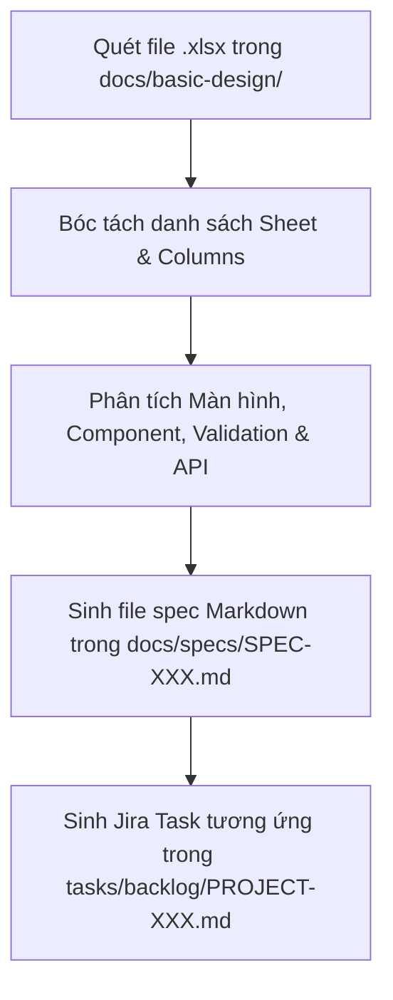

# SKILL CÓ SẴN: PHÂN TÍCH EXCEL BASIC DESIGN SANG MARKDOWN SPECS (parse-basic-design-excel.md)

Skill này hướng dẫn AI Agent đọc các file Excel (`.xlsx`) thiết kế cơ sở trong `docs/basic-design/` để tự động bóc tách dữ liệu và sinh ra các file Đặc Tả Markdown (`docs/specs/`) và Task Jira (`tasks/backlog/`) theo từng màn hình/tính năng.

---

## 🎯 MỤC TIÊU SKILL
Tự động hóa 100% quá trình đọc tài liệu thiết kế cơ sở từ file Excel của PO/BA/Khách hàng, chuyển đổi thành tài liệu chuẩn hóa Markdown để toàn bộ team lập trình và AI Agent cùng sử dụng thống nhất.

---

## 📋 CÁC BƯỚC THỰC THI (PROCEDURE)



### Bước 1: Quét và Đọc File Excel (`.xlsx`)
- Sử dụng các thư viện phân tích file (như Python `pandas` / `openpyxl` hoặc Node `xlsx`) để trích xuất nội dung các sheet:
  - **Sheet 1**: Danh sách màn hình (Screen ID, Screen Name, Module, Access Level).
  - **Sheet 2**: Chi tiết Layout & Component (Fields, Input Type, Mandatory/Optional, Max Length, Validation rules).
  - **Sheet 3**: Danh sách API / DB Mapping (Endpoint, Method, Request/Response payload, Database table).

### Bước 2: Tự Động Sinh File Đặc Tả Markdown (`docs/specs/`)
Đối với mỗi màn hình/tính năng bóc tách được từ Excel, sinh file `docs/specs/SPEC-<ScreenID>-<screen-name>.md`:
```markdown
# ĐẶC TẢ TÍNH NĂNG: [Screen Name] (SPEC-<ScreenID>)

- **Màn hình**: `<ScreenID> - <ScreenName>`
- **Nguồn tài liệu**: `docs/basic-design/<filename>.xlsx`

## 🎯 1. MỤC TIÊU MÀN HÌNH
[Mô tả mục tiêu của màn hình từ Excel]

## 📋 2. DANH SÁCH TRƯỜNG DỮ LIỆU & VALIDATION (INPUT FIELDS)
| Component / Field | Loại Input | Bắt buộc | Validation Rules | Ghi chú |
| :--- | :--- | :---: | :--- | :--- |
| Email | Text Input | Có | Email format, Max 100 char | Unique in DB |
| Password | Password | Có | Min 8 char, special char | Hidden mask |

## 🔌 3. DANH SÁCH API KẾT NỐI
- **Endpoint**: `POST /api/v1/auth/login`
- **Request Payload**: `{ email, password }`
- **Response**: `{ token, refreshToken, user }`
```

### Bước 3: Tự Động Sinh Jira Tasks Backlog (`tasks/backlog/`)
Tạo ngay các task Jira chuẩn cho từng màn hình: `tasks/backlog/PROJECT-<ScreenID>.md` để sẵn sàng bàn giao cho các thành viên trong team triển khai.
