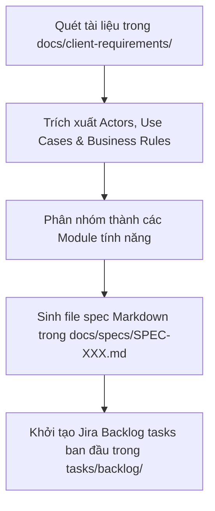

# SKILL CÓ SẴN: PHÂN TÍCH TÀI LIỆU YÊU CẦU BAN ĐẦU CỦA KHÁCH HÀNG (parse-client-requirements.md)

Skill này hướng dẫn AI Agent phân tích các file tài liệu yêu cầu ban đầu (BRD / Client Requirements) trong `docs/client-requirements/` khi mới khởi tạo dự án để tự động bóc tách và tạo bộ Đặc Tả Markdown (`docs/specs/`) cùng Jira Backlog Tasks (`tasks/backlog/`).

---

## 🎯 MỤC TIÊU SKILL
Chuyển đổi tài liệu mô tả thô của khách hàng thành cấu trúc tài liệu phát triển phần mềm chuẩn hóa, giúp lập trình viên và AI Agent hiểu thống nhất bài toán ngay từ ngày đầu tiên.

---

## 📋 CÁC BƯỚC THỰC THI (PROCEDURE)

### Bước 1: Quét và Đọc Tài Liệu Đầu Vào
- Đọc tất cả các file trong `docs/client-requirements/`.
- Nhận diện các đối tượng người dùng (Actors), bài toán nghiệp vụ, luồng xử lý chính và các ràng buộc hệ thống.

### Bước 2: Phân Nhóm Module & Sinh Đặc Tả Markdown (`docs/specs/`)
- Đối với mỗi Module/Tính năng bóc tách được, sinh file `docs/specs/SPEC-XXX-<feature-name>.md`:
  - **Mục tiêu & Phạm vi (Scope)**
  - **User Stories (As a / I want to / So that)**
  - **Danh sách Yêu cầu Năng lực (Functional Requirements - FRs)**
  - **Ràng buộc Bảo mật & Hiệu năng (Non-Functional Requirements - NFRs)**

### Bước 3: Tạo Dàn Khung Jira Backlog Tasks (`tasks/backlog/`)
- Sinh bộ task chuẩn Jira Backlog cho từng Module tính năng để chuẩn bị phân công trong Sprint 1.
