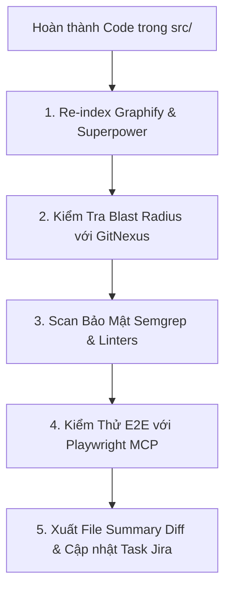

# SKILL CÓ SẴN: REVIEW TỰ ĐỘNG SAU KHI IMPLEMENT (post-implementation-review.md)

Skill này hướng dẫn AI Agent thực hiện bước kiểm tra, đánh giá toàn diện mã nguồn **SAU KHI HOÀN THÀNH BIÊN SẠN CODE** và trước khi nộp Pull Request.

---

## 🎯 MỤC TIÊU SKILL
Xác nhận rằng code mới viết không làm hỏng kiến trúc hiện tại, không gây vỡ Knowledge Graph, không nảy sinh rủi ro bảo mật và thỏa mãn 100% Acceptance Criteria.

---

## 📋 5 BƯỚC REVIEW SAU IMPLEMENT (POST-IMPLEMENTATION REVIEW)

### 1. Re-index Knowledge Graph (Graphify & Superpower Check)
- Chạy lệnh re-index Graphify và Superpower để đảm bảo các import/export mới không bị hỏng liên kết (Broken links/Circular dependencies).

### 2. Phân Tích Lại Blast Radius (GitNexus Verification)
- Cho GitNexus phân tích lại scope file đã chỉnh sửa.
- So sánh Blast Radius trước và sau khi implement để đảm bảo không có tác dụng phụ ngoài dự kiến (Unexpected Side Effects).

### 3. Quét Bảo Mật & Static Analysis
- Chạy **Semgrep** quét lỗ hổng bảo mật: `semgrep scan --config auto src/`
- Chạy linter tương ứng (`eslint`, `phpstan`, `rubocop`...) đảm bảo 0 warning, 0 error.

### 4. Kiểm Thử Giao Diện & API (Playwright MCP)
- Sử dụng Playwright MCP chạy qua các kịch bản nghiệm thu (Acceptance Criteria) trong Jira Task.
- Chụp ảnh màn hình bằng chứng (Proof artifact) nếu có giao diện UI.

### 5. Xuất Bản Báo Cáo Review & Cập Nhật Task
- Tổng hợp danh sách các file đã chỉnh sửa.
- Đưa task từ `tasks/in-progress/` sang `tasks/completed/`.
- Sẵn sàng gọi **GitHub MCP** để commit và mở PR kèm nhận xét tự động từ **CodeRabbit**.
