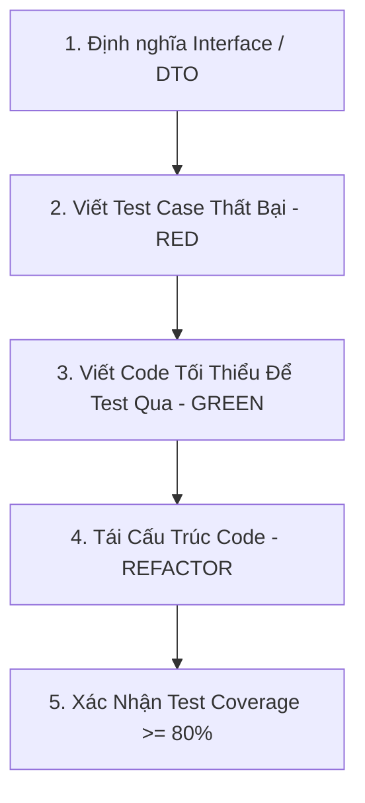

# SKILL CÓ SẴN: QUY TRÌNH TDD - TEST DRIVEN DEVELOPMENT (tdd-workflow.md)

Skill này hướng dẫn AI Agent thực hiện lập trình theo phương pháp TDD (Test-Driven Development) chuẩn hóa.

---

## 🎯 MỤC TIÊU SKILL
Viết unit test trước khi viết business code, đảm bảo test coverage tối thiểu 80% và không có hỏng hóc logic khi refactor.

---

## 📋 CHU TRÌNH 5 BƯỚC TDD (RED -> GREEN -> REFACTOR)

1. **Định nghĩa Interfaces / Types**: Đặt sẵn khung Interface hoặc DTO trong `src/shared/` hoặc `src/backend/`.
2. **RED**: Viết Unit Test case mô tả hành vi kỳ vọng. Chạy test và đảm bảo test BỊ THẤT BẠI (do chưa có code xử lý).
3. **GREEN**: Viết lượng code vừa đủ ít nhất để Unit Test vừa viết CHẠY QUA (Pass).
4. **REFACTOR**: Tối ưu hóa lại mã nguồn (Clean Code, xóa trùng lặp) mà vẫn giữ cho Unit Test trôi qua 100%.
5. **VERIFY**: Chạy công cụ đo test coverage để xác nhận đạt chỉ tiêu >= 80%.
