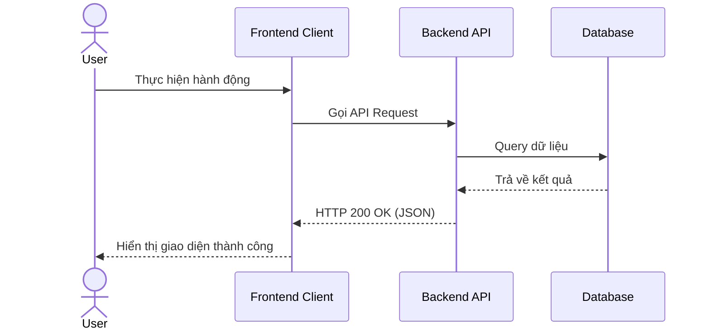

# ĐẶC TẢ TÍNH NĂNG: [TÊN TÍNH NĂNG] (spec-template.md)

- **Mã Đặc Tả**: `SPEC-XXX`
- **Jira Epic/Story**: `PROJECT-XXX`
- **Trạng thái**: [Draft / In-Review / Approved]
- **Tác giả**: [Tên tác giả / PO]
- **Cập nhật lần cuối**: `YYYY-MM-DD`

---

## 🎯 1. TỔNG QUAN VÀ MỤC TIÊU
[Mô tả mục tiêu sản phẩm, bài toán nghiệp vụ cần giải quyết và giá trị mang lại cho người dùng.]

---

## 👤 2. USER STORIES & LUỒNG NGƯỜI DÙNG (USER FLOW)

### Story 1: [Tiêu đề User Story]
As a [Loại người dùng]  
I want to [Hành động]  
So that [Giá trị nhận được]

### User Flow Diagram:

---

## ⚙️ 3. YÊU CẦU NĂNG LỰC NGHIỆP VỤ (FUNCTIONAL REQUIREMENTS)

1. **[FR-1]**: [Mô tả chi tiết yêu cầu 1]
2. **[FR-2]**: [Mô tả chi tiết yêu cầu 2]

---

## 🔒 4. YÊU CẦU PHI CHỨC NĂNG (NON-FUNCTIONAL REQUIREMENTS)
- Performance: Response time API < 200ms.
- Security: Phải authenticate bằng JWT token Bearer.
