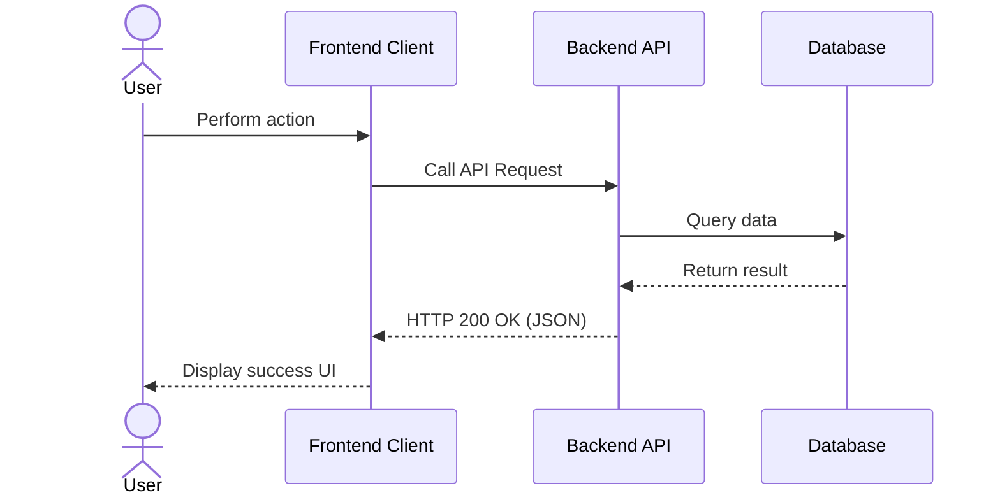

# FEATURE SPECIFICATION: [FEATURE NAME] (spec-template.md)

- **Spec ID**: `SPEC-XXX`
- **Jira Epic/Story**: `PROJECT-XXX`
- **Status**: [Draft / In-Review / Approved]
- **Author**: [Author name / PO]
- **Last updated**: `YYYY-MM-DD`

---

## 🎯 1. OVERVIEW AND GOALS
[Describe the product goal, the business problem to solve, and the value delivered to users.]

---

## 👤 2. USER STORIES & USER FLOW

### Story 1: [User Story title]
As a [User type]  
I want to [Action]  
So that [Value received]

### User Flow Diagram:

---

## ⚙️ 3. FUNCTIONAL REQUIREMENTS

1. **[FR-1]**: [Detailed description of requirement 1]
2. **[FR-2]**: [Detailed description of requirement 2]

---

## 🔒 4. NON-FUNCTIONAL REQUIREMENTS
- Performance: API response time < 200ms.
- Security: Must authenticate with a JWT Bearer token.
